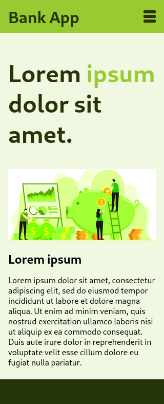

    <h1 style='font-size: 2.5rem;'>A fake banking app</h1>
    <h2 style='font-size: 2rem;'>Mobile Sizes</h2>
    

        
    

    <h2 style='font-size: 2rem;'>Large Sizes</h2>
    

        <h2>WIP</h2>
    

